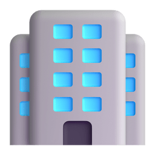

<h1 align="center">
 Olá 
</h1>

Hi, my name is Hugo. I am a curious person and enjoy the challenge of problem-solving. I am constantly working on developing my skills and improving my knowledge to find the most effective and efficient solution to challenges. I am also constantly pushing myself to learn new skills which makes me more motivated to take on new tasks and challenges. I feel that this combination aids my goal of continuous improvement and personal growth. 
 

#  Work & Education:

<table>
<tr>
<td style="width:50%">

-  **Digital Futures**:
  - **Software Engineering**
    - June 2020 - Present.
        - Fundamentals:
            - JavaScript Fundamentals Challenge  : `Pass`.
        - Sofware Design:
            - Bank challenge  : `Pass`.
            - Refactoring challenge  : `Pass`.
            - Test-driven development  : `Pass`.
            - Bitmap editor challenge  : `Pass`.
        - Software Development 1:
            - 3rd-party integration  : `Pass`.
        - Software Development 2:
            - Server Side Development (NodeJS) Challenge  : `Pass`.
            - Full Stack (JavaScript & MongoDB) Challenge  : `Pass`.
        - Team Engineering:
            - Java Fundamentals Challenge  : `Pass`.
            - Agile Team Collaboration Challenge  : `Pass`.
        - Professional Skills:
            - Interview challenges  : `Pass`.
</td>
<td>

-  **University of Brighton**:
  - **BSc Software Engineering**
    - October 2020 - Present.
        - Final Grade : `TBC`.
         

-  **East Surrey College**:
  - **Internet Software Development (FdSc)**
    - September 2016 – July, 2018.
        - Final Grade : `Merit`.
 

-  **Kingston College**:
  - **Internet Software Development (FdSc)**
    - September 2013 – June, 2014.
        - Final Grade : `Pass`.
 

-  **Escola Profissional Bento de Jesus Caraça**:
  - **2 Years of studying Computer Equipment Management Technician**
    - June 2010 – June, 2012.
        - First Year: `Pass`.
        - Second Year: `Pass`.
        - Third Year: `Incomplete, moved to the UK`.
        
</td>
</tr>
</table>

#   Skills :

                      
 

#  Currently:

I’m currently working on two FullStack applications. 

 The main one is a project where people can search for other people who wants to play the same video game. 
 
 The side project is a payroll CRM system with an android application where the employees can check their timetables, holidays and salary. 
 

#  Socials:

 

# 📊 GitHub Stats:

 

###  Random Dev Quote

---

<<<<<<< HEAD
=======
<!-- ## 2. Most Used Languages
 -->

>>>>>>> 285febc236d0a2df6bcc7a17e7abaa7a7575648e
